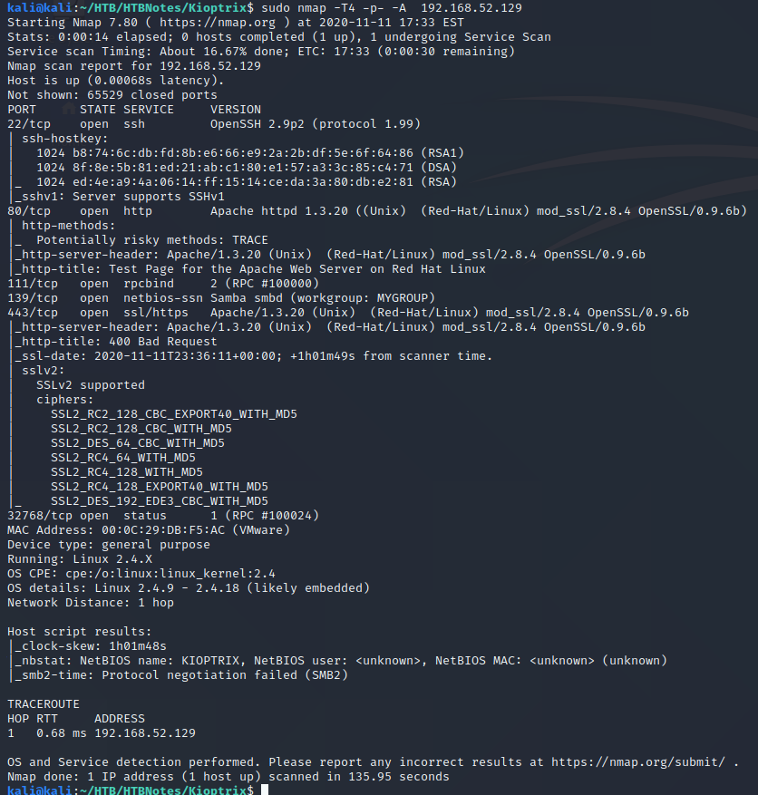
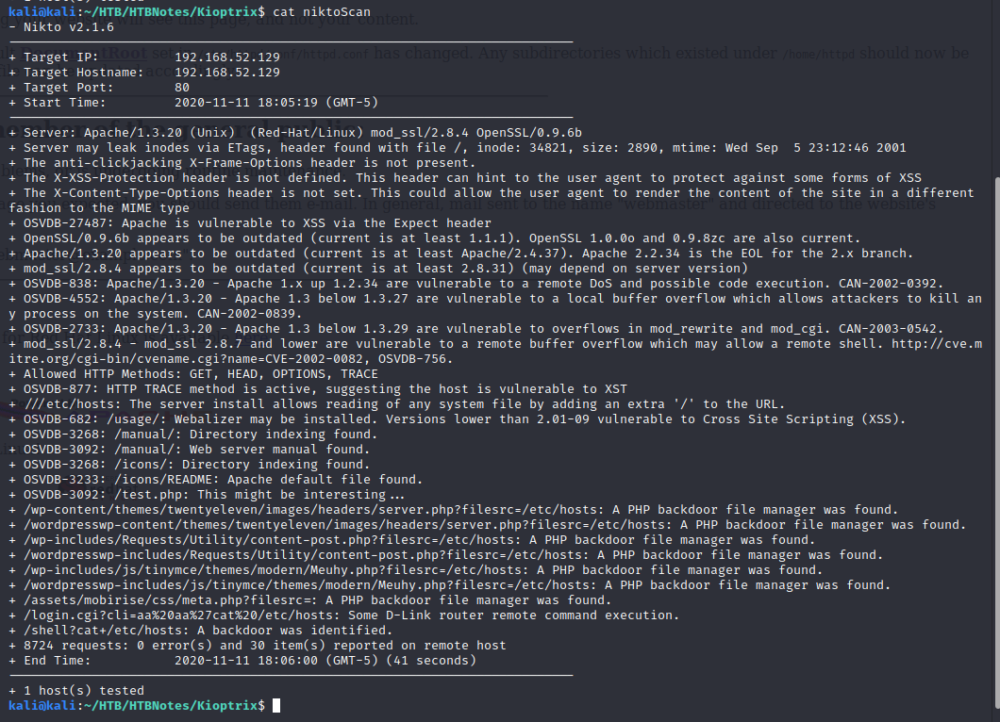
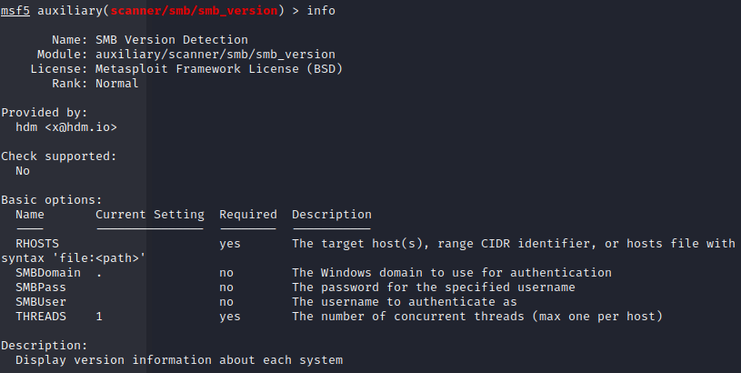
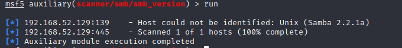

# Hostname and IP
kioptrix
192.168.52.129

# Nmap scan

# Interesting ports TCP and UDP
22 tcp ssh  OpenSSH 2.9p2
80 tcp http Apache httpd 1.3.20 ((Unix) (Red-Hat/Linux) mod_ssl2.8.4 OpenSSL/0.9.6b)
111 tcp rpcbind
139 tcp netbios-ssn Samba smbd
443 tcp ssl/https httpd 1.3.20 ((Unix) (Red-Hat/Linux) mod_ssl2.8.4 OpenSSL/0.9.6b) 
32768 tcp ???

# web enumeration
## Nikto

## SMB Enumeration

# initial point of acces
##    -user proof
    
# Root access

##   -root proof and additional required screenshots
    
# Post Enumeration
    
    

